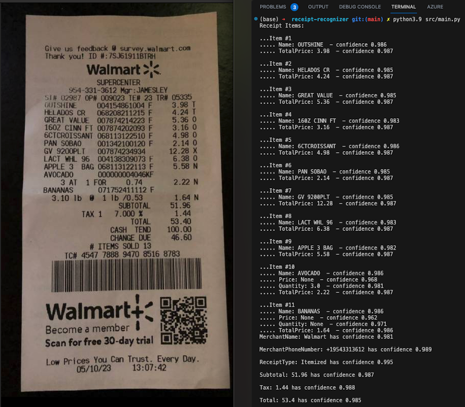

# Receipt Recognizer
A Python program that extracts key information and returns structured JSON data.

### Tech stack
Python, Azure Form Recognizer, Azure Storage.

The **Python** program accesses the receipt image from **Azure Storage** then uses **Form Recognizer**'s receipt model to analyze and extract key information from the receipt.

### Preview
